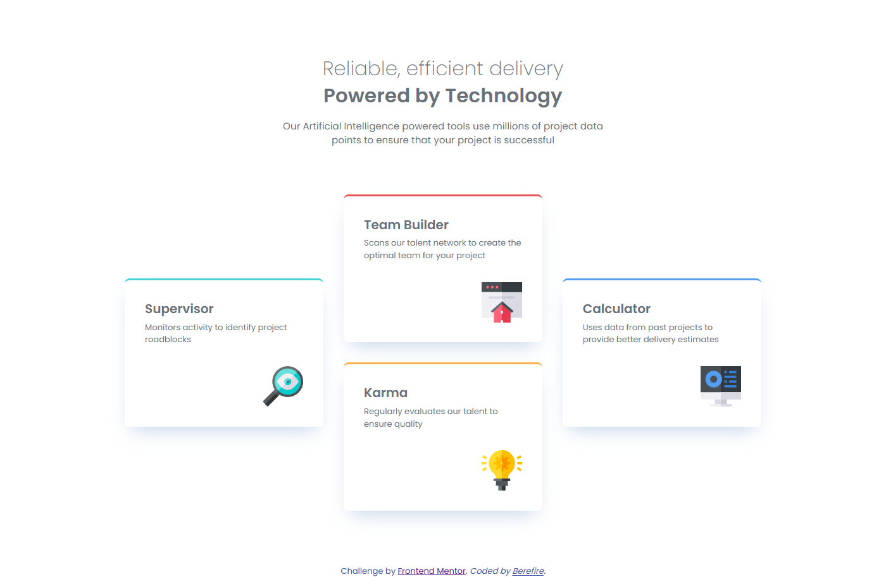
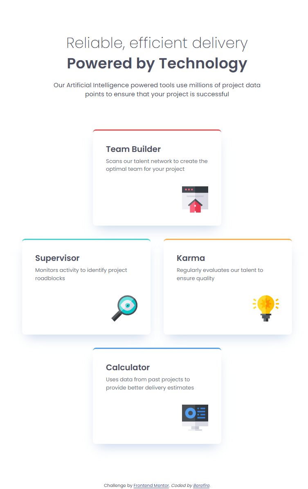
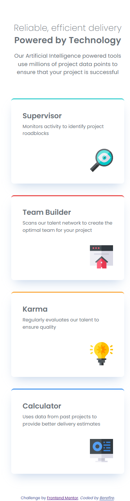

# Frontend Mentor - Four card feature section solution

This is a solution to the [Four card feature section challenge on Frontend Mentor](https://www.frontendmentor.io/challenges/four-card-feature-section-weK1eFYK). Frontend Mentor challenges help you improve your coding skills by building realistic projects.

---

## Table of contents

- [Overview](#-overview)
  - [The challenge](#-the-challenge)
  - [Screenshot](#screenshot)
    - [Desktop](#desktop)
    - [Tablet](#tablet)
    - [Mobile](#mobile)
  - [Links](#links)
- [My process](#️-my-process)
  - [Architecture](#️-architecture)
    - [Layer responsabilities](#layer-responsibilities)
  - [Component strategy](#-component-strategy)
  - [Built with](#️-built-with)
  - [Design System Foundations](#-design-system-foundations)
    - [Design Tokens](#design-tokens)
  - [Responsive Strategy](#-responsive-strategy)
  - [What I Reinforced](#-what-i-reinforced)
  - [Accesibility Considerations](#-accessibility-considerations)
- [Author](#-author)
- [Acknowledgments](#-acknowledgments)

---

## 📋 Overview

This project recreates the Four Card Feature layout using semantic HTML and a structured CSS architecture based on **CUBE CSS** principles and **BEM methodology**.

---

### 🎯 The challenge

Users should be able to:

- View the optimal layout across mobile, tablet, and desktop breakpoints
- Experience a structured responsive grid layout
- Read clearly structured content with proper typographic scaling

---

### 📸Screenshot

#### Desktop



#### Tablet



#### Mobile



---

### 🔗Links

- Solution URL: [https://www.frontendmentor.io/solutions/four-card-feature-section-cube-css-and-bem-implementation-79tjNTytIi](https://www.frontendmentor.io/solutions/four-card-feature-section-cube-css-and-bem-implementation-79tjNTytIi)
- Live Site URL: [https://berefire.github.io/four-card-feature-section/](https://berefire.github.io/four-card-feature-section/)

---

## ⚙️ My process

This project was developed using a mobile-first workflow, progressively enhancing the layout with CSS Grid at larger breakpoints.

The focus was not only visual accuracy, but also building a scalable CSS architecture.

---

### 🏗️ Architecture

This project follows the CUBE CSS methodology, organized into clearly separated layers:

```html
css/
├── base/
│   ├── fonts.css
│   ├── reset.css
│   ├── tokens.css
│   └── global.css
│
├── composition/
│   ├── cover.css
│   ├── page.css
│   ├── stack.css
│   └── box.css
│
├── utilities/
│   ├── text.css
│   └── link.css
│
├── blocks/
│   ├── card.css
│   ├── titles.css
│   └── attribution.css
│
└── main.css
```

#### Layer Responsibilities

- **Base** → Design tokens, reset, global styles, typography foundations
- **Composition** → Layout primitives (grid systems, spacing flow, structural patterns)
- **Utilities** → Small single-purpose helpers
- **Blocks** → Self-contained UI components

This separation ensures that:

- Layout logic does not leak into component styling
- Components remain portable and predictable
- Styling scales cleanly for larger systems

---

### 🧩 Component Strategy

The card component follows **BEM modifiers** for variants:

```html
<div class="card card--supervisor"></div>
<div class="card card--team"></div>
```

- `.card` → Base block
- `.card--modifier` → Visual variant

Grid placement (`grid-area`) is handled at the composition level, preserving separation between layout and component styling.

---

### 🛠️ Built with

- Semantic HTML5
- CSS Custom Properties (Design Tokens)
- CSS Grid
- Mobile-first workflow
- CUBE CSS architecture
- BEM naming conventions
- Logical properties (`margin-block`, `border-block-start`)
- Fluid typography with `clamp()`
- Local font hosting ( Poppins )

---

### 🎨 Design System Foundations

#### Design Tokens

The project uses CSS custom properties to define:

- Color system
- Spacing scale
- Typography scale
- Font weights
- Shadows
- Border radius
- Breakpoints

Example:

```css
:root {
  --color-bg-supervisor: hsl(180, 62%, 55%);
  --space-lg: 2.13rem;
  --fs-lg: 1.6rem;
}
```

This enables:

- Consistent spacing rhythm
- Centralized visual control
- Easy future refactoring

---

### 📐 Responsive Strategy

The layout is built using CSS Grid with `grid-template-areas`, progressively enhanced across breakpoints.

- Mobile → Single column flow
- Tablet → Structured grid
- Desktop → Cross-aligned asymmetric layout

The implementation ensures:

- Predictable content flow
- Minimal layout overrides
- Clear visual hierarchy

---

### 📚 What I Reinforced

Through this project, I strengthened my understanding of:

- How to properly structure projects using **CUBE CSS and BEM**
- The importance of using **design tokens** for scalability
- How to implement **fluid typography** with `clamp()`
- Improving accessibility with `aria-labelledby` and `:focus-visible`
- Organizing CSS for long-term maintainability
- Using logical properties for better internationalization support

---

### ♿ Accessibility Considerations

- Semantic HTML structure
- Proper heading hierarchy
- Descriptive alt attributes
- Readable typography scaling
- Sufficient color contrast
- No reliance on color as the sole visual indicator

---

### 🚀 Future Improvements

- Introduce container queries
- Implement CSS layers (@layer)
- Add subtle motion while respecting prefers-reduced-motion
- Extract layout primitives into a reusable component system
- Expand token system into a more complete design system

---

## 👤 Author

- Frontend Mentor - [@berefire](https://www.frontendmentor.io/profile/berefire)
- GitHub - [@berefire](https://github.com/berefire)

---

## 🙏 Acknowledgments

Thanks to Frontend Mentor for providing realistic frontend challenges that help developers practice real-world layout techniques and architecture patterns.
